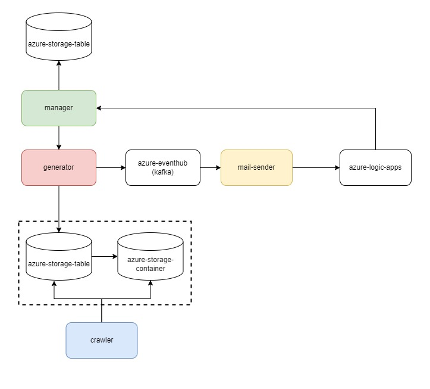
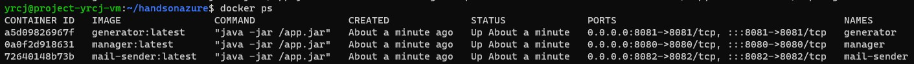

# HandsOnAzure Project

## Auto Advertisement Generator

Generate ad every hours and send advertising mail to user that subscribes specific category.

details on each application:
- [manager](https://github.com/dksshddl/HandsOnAzure/tree/master/project/manager)
- [generator](https://github.com/dksshddl/HandsOnAzure/tree/master/project/generator)
- [mail-sender](https://github.com/dksshddl/HandsOnAzure/tree/master/project/mail-sender)
- [crawler](https://github.com/dksshddl/HandsOnAzure/tree/master/project/crawler)

## Structure


## Getting Started

### 1. 필요 요소 설치하기

- jdk11 (+gradle, maven)
- python3.8
- docker, docker-compose

```
$./scripts/prerequisites.sh
```
### 2. 빌드
maven/gradle build, docker build, python venv setting
```
$./scripts/build.sh
```
### 3. 광고 저장하기 (Optional)
crawling advertisement (coupang)
```
$./scripts/run-crawler.sh
```
### 4. 시작하기
```
docker-compose up -d
```
or (equals)
```
$./scripts/docker-compose-up.sh
```

### 5. 중지하기
```
docker-compose down
```

or (equals)
```
$./scripts/docker-compose-down.sh
```

### 6. 확인하기
```
$ docker ps
```

