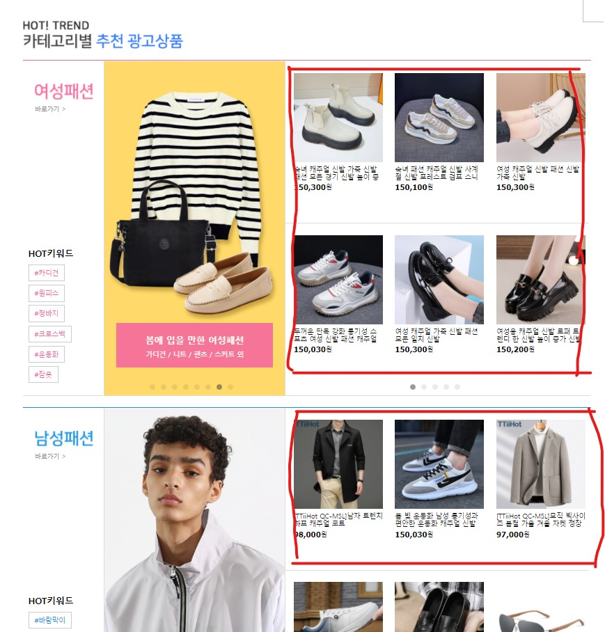

# 광고 크롤링 (쿠팡)

## 크롤링 정보

아래 사진의 빨간 박스 부분을 크롤링하여 광고 정보를 저장



광고 엔티티 저장 code 
``` python
entity['PartitionKey'] = "Advertisement"
entity['RowKey'] = str(uuid.uuid4()).replace("-", "")
entity['ItemLink'] = item_info.get_attribute("href")
entity['Name'] = item_info.find_element(By.CLASS_NAME, "name").get_attribute('textContent')
entity['Price'] = item_info.find_element(By.CLASS_NAME, "price").find_element(By.TAG_NAME, "strong").get_attribute('textContent')
entity['CategoryEn'] = category_en
entity['CategoryKo'] = category_ko
entity['ImgLink'] = "https://adgenstorage.blob.core.windows.net/advertisement/"+entity['RowKey']+".jpg"
```

## Chanllenge

1. OS에 따른 chromedriver 파일 설정
2. 쿠팡 페이지에서 최초에 추천 광고상품을 로딩하지않음 (마우스 조작 및 로딩대기 필요)
``` python
bestUnit = WebDriverWait(browser, 5).until(EC.presence_of_element_located((By.XPATH, 
                                    '/html/body/div[3]/section[2]/div[9]'))) # 브라우저 로딩 대기
ActionChains(browser).move_to_element(bestUnit).perform()  # 마우스 조작을 통해 best trend 로딩
```