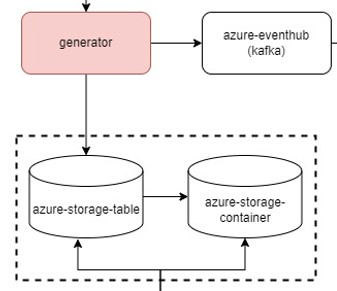
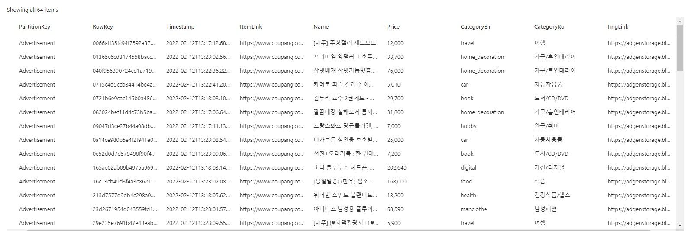
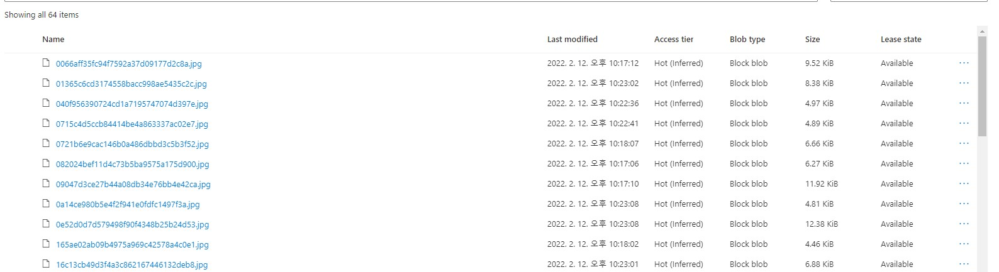

# 광고생성 서비스

1. 매 시간마다 azure-storage-blob에서 광고를 가져온다.
2. eventhub에 광고를 push한다.

> azure storage, blob에 광고를 채우는 방법은 [crawler](../crawler) 학인

## azure storage table 구조

## azure storage blob

> azure storage의 PK인 RowKey로 image 경로를 생성 (${RowKey}.jpg)
