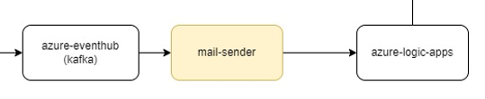
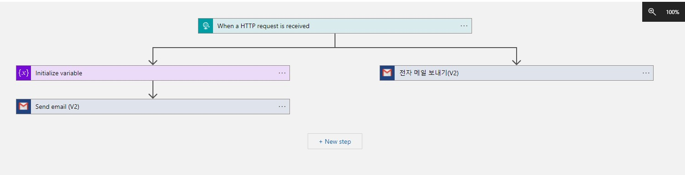
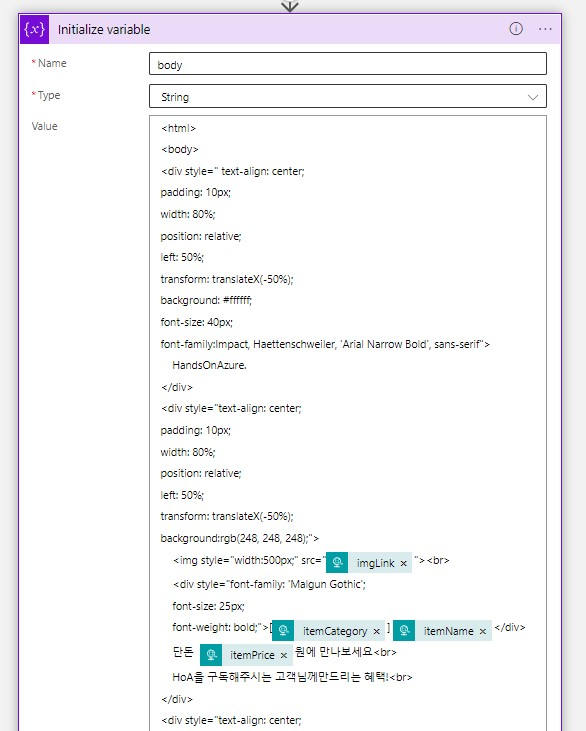
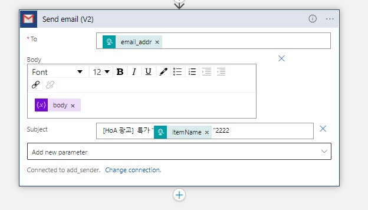

# 메일전송 서비스

1. eventhub listen하여, 모든 광고를 수신한다/
2. 광고가 들어오면 광고 카테고리를 통해 관심사 테이블에 접근하여 동일한 관심사를 가진 데이터를 가져온다.
3. 관심사 데이터를 통해 사용자 테이블에 접근하여 유저 메일 주소를 가져온다.
광고의 대한 정보와 피드백을 위한 link를 첨부하여 azure-logic-apps에 feign client를 호출한다. (메일 전송)

# Logic Apps

## Logic Apps Designer 전체 구조

## Logic Apps initialize variables
logic apps의 initialize variables을 통해 html body를 꾸밀 수 있다.

## Logic Apps send mail
initialize variables을 body로 설정하여 구글 이메일을 전송해준다.

