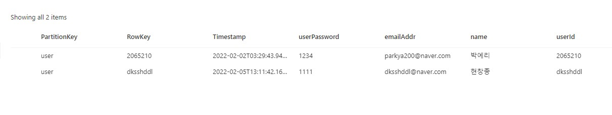
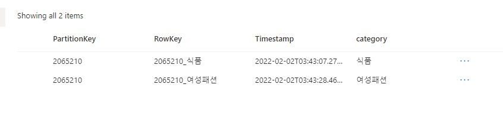

# 회원관리 서비스

[swagger-ui](http://yrcj.eastus.cloudapp.azure.com:8080/manager/swagger-ui/index.html)

## 1. 주요 기능
- 회원가입/탈퇴/수정 
- 관심 카테고리 설정
- 피드백(광고 싫어요, 좋아요) 설정

## 2. Entity

Azure storage table에 저장하려면 PartitionKey, RowKey를 설정해주어야 한다.\
PartitionKey는 테이블 내 PartitionKey로 엔티티를 분할하는 역할을 하며, RowKey는 entity의 PK이다.\
manager app에서는 3개의 entity를 관리한다.
- [User Entity](#User Entity) : 사용자의 정보를 저장하는 테이블
- [Concern Entity](#Concern Entity) : 사용자의 관심사를 저장하는 테이블
- [Item Entity](#Item Entity) : 사용자의 아이템 피드백을 저장하는 테이블

### 2.1 User Entity
사용자의 정보를 저장하는 테이블

 Partitionkey는 `user` 로 고정,  RowKey는 userId와 같은 값으로 설정

| PartitionKey | RowKey   | userPassword | emailAddr          | name | userId   |
|--------------|----------|--------------|--------------------|------|----------|
| user         | dksshddl | ****         | dksshddl@naver.com | 현창종  | dksshddl |

#### 실제 User Entity storage 정보

### 2.2 Concern Entity
사용자의 관심사를 저장하는 테이블

PartitionKey는 userId, RowKey는 userId_category 형식으로 저장한다.

| PartitionKey | RowKey      | category |
|--------------|-------------|----------|
| dksshddl     | dksshddl_식품 | 식품       |

#### 실제 Concern Entity storage 정보

### 2.3 Item Entity
사용자의 아이템 피드백을 저장하는 테이블
PartitionKey를 이용하여 LIKE, HATE를 구분하고 ItemId, UserId를 저장한다.
RowKey는 UserId_ItemId로 생성한다.

| PartitionKey | RowKey                                    | ItemId                           | UserId   |
|--------------|-------------------------------------------|----------------------------------|----------|
| LIKE         | dksshddl_0066aff35fc94f7592a37d09177d2c8a | 0066aff35fc94f7592a37d09177d2c8a | dksshddl |
| HATE         | dksshddl_01365c6cd3174558bacc998ae5435c2c | 01365c6cd3174558bacc998ae5435c2c | dksshddl |

#### 실제 Item Entity storage 정보
TODO (add image)

## 3. 출처
- [Azure Storage table의 이해](https://docs.microsoft.com/en-us/rest/api/storageservices/Understanding-the-Table-Service-Data-Model)